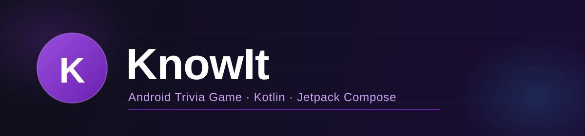

<div align="center">
  

  <br/>
  <br/>

  [](https://github.com/HighviewOne/KnowIt/actions/workflows/build.yml)
  [](https://github.com/HighviewOne/KnowIt/releases)
  [](https://github.com/HighviewOne/KnowIt)
  [](https://kotlinlang.org)
  [](https://developer.android.com/jetpack/compose)
  [](LICENSE)

  <br/>

  **[🌐 Website](https://highviewone.github.io/KnowIt/)** &nbsp;·&nbsp; **[📥 Download Latest](https://github.com/HighviewOne/KnowIt/releases/latest)**

  <br/>

  *A fast-paced Android trivia game with streak scoring, animated feedback,*
  *and a persistent high-score tracker — built entirely with Jetpack Compose.*

</div>

---

## Features

- **20 questions** across 5 categories: 🔬 Science · 📜 History · 🌍 Geography · 🎬 Pop Culture · 💻 Tech
- Alternating **Multiple Choice** and **Type-In** question formats
- **Streak scoring** — rack up bonuses for consecutive correct answers
- **Persistent high score** stored with Jetpack DataStore
- Polished animations: confetti, card shake, green glow, animated score counter
- Adaptive icon · accessibility labels · edge-to-edge layout

## Gameplay

| Event | Points |
|---|---|
| Correct answer | +10 |
| Streak bonus (2+ consecutive correct) | +5 per answer |
| Wrong answer | 0 · streak resets |

**Max possible score: 295 pts** (all 20 correct, full streak)

## Screens

| Home | Game | Result |
|---|---|---|
| Animated title with pulse effect, high-score display, Play button | Live score counter, streak indicator, category progress bar, confetti on correct | Letter grade (A+→F), accuracy %, correct count, best-score tracker |

## Tech Stack

| | |
|---|---|
| Language | Kotlin 2.0.21 |
| UI | Jetpack Compose (BOM 2024.11.00) |
| Architecture | MVVM · `StateFlow` · `ViewModel` |
| Persistence | Jetpack DataStore Preferences |
| Build | AGP 8.6.1 · Gradle 8.9 · JVM 17 |
| Min SDK | 26 (Android 8.0) |
| Target SDK | 35 (Android 15) |

## Getting Started

### Android Studio (recommended)

```bash
git clone https://github.com/HighviewOne/KnowIt.git
```

1. Open the project in **Android Studio Hedgehog** or newer
2. Click **Sync Now** — Studio generates `gradle-wrapper.jar` automatically
3. Run on any API 26+ emulator or physical device

**Physical device:** enable **USB Debugging** in Developer Options, plug in, and select it as the run target.

### Build from the terminal

After the first Android Studio sync (which generates the Gradle wrapper):

```bash
./gradlew assembleDebug
# Output: app/build/outputs/apk/debug/app-debug.apk
```

### Sideload from a release

1. Download `knowit-vX.X.apk` from [Releases](https://github.com/HighviewOne/KnowIt/releases)
2. On your Android device: **Settings → Install unknown apps** → allow your browser/file manager
3. Tap the APK and install

## Project Structure

```
app/src/main/
└── kotlin/com/knowit/
    ├── MainActivity.kt
    ├── model/Question.kt              # Data models: Question, Category, QuestionType
    ├── data/
    │   ├── QuestionBank.kt            # 20 trivia questions
    │   └── HighScoreRepository.kt     # DataStore read/write
    ├── viewmodel/
    │   ├── GameViewModel.kt           # Game state, scoring & streak logic
    │   └── GameViewModelFactory.kt
    └── ui/
        ├── theme/                     # Color, Type, Theme
        └── screens/
            ├── HomeScreen.kt          # Animated home with entrance effects
            ├── GameScreen.kt          # Confetti, shake, glow animations
            └── ResultScreen.kt        # Grade, accuracy, high-score display
```

## Contributing

Bug reports and feature ideas are welcome! Please use the [issue tracker](https://github.com/HighviewOne/KnowIt/issues).

Pull requests should target the `main` branch. See the [PR template](.github/pull_request_template.md) for what to include.

## License

[MIT](LICENSE)
