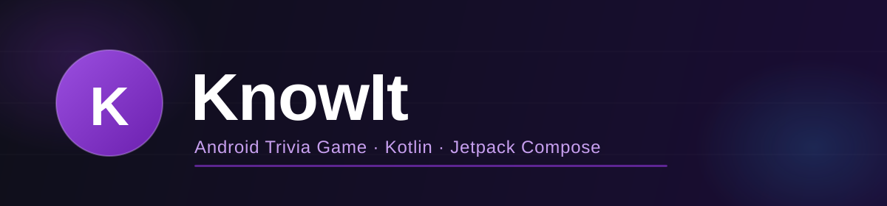

<div align="center">
  

  <br/>
  <br/>

  [](https://github.com/HighviewOne/KnowIt/actions/workflows/build.yml)
  [](https://github.com/HighviewOne/KnowIt/releases)
  [](https://github.com/HighviewOne/KnowIt)
  [](https://kotlinlang.org)
  [](https://developer.android.com/jetpack/compose)
  [](LICENSE)

  <br/>

  **[🌐 Website](https://highviewone.github.io/KnowIt/)** &nbsp;·&nbsp; **[📥 Download Latest](https://github.com/HighviewOne/KnowIt/releases/latest)**

  <br/>

  *A fast-paced Android trivia game with streak scoring, animated feedback,*
  *and a persistent high-score tracker — built entirely with Jetpack Compose.*

</div>

---

## Features

- **20 questions per game**, drawn from a bank of 50 across 5 categories: 🔬 Science · 📜 History · 🌍 Geography · 🎬 Pop Culture · 💻 Tech
- Alternating **Multiple Choice** and **Type-In** question formats, freshly drawn and shuffled every game
- **Streak scoring** — rack up bonuses for consecutive correct answers
- **Persistent high score** stored with Jetpack DataStore
- Polished animations: confetti, card shake, green glow, animated score counter
- Adaptive icon · accessibility labels · edge-to-edge layout · system Back returns to the home screen

## Gameplay

| Event | Points |
|---|---|
| Correct answer | +10 |
| Streak bonus (2+ consecutive correct) | +5 per answer |
| Wrong answer | 0 · streak resets |

**Max possible score: 295 pts** (all 20 correct, full streak)

## Screens

| Home | Game | Result |
|---|---|---|
| Animated title with pulse effect, high-score display, Play button | Live score counter, streak indicator, category progress bar, confetti on correct | Letter grade (A+→F), accuracy %, correct count, best-score tracker |

## Tech Stack

| | |
|---|---|
| Language | Kotlin 2.4.20 |
| UI | Jetpack Compose (BOM 2026.09.00) |
| Architecture | MVVM · `StateFlow` · `ViewModel` |
| Persistence | Jetpack DataStore Preferences |
| Build | AGP 9.4.1 · Gradle 9.8.0 · JVM 17 |
| Min SDK | 26 (Android 8.0) |
| Compile SDK | 37 |
| Target SDK | 35 (Android 15) |

## Getting Started

### Android Studio (recommended)

```bash
git clone https://github.com/HighviewOne/KnowIt.git
```

1. Open the project in a current **Android Studio** (one that supports AGP 9.4)
2. Click **Sync Now**
3. Run on any API 26+ emulator or physical device

**Physical device:** enable **USB Debugging** in Developer Options, plug in, and select it as the run target.

### Build from the terminal

Requires JDK 17 and the Android SDK (`ANDROID_HOME` or `local.properties`). The Gradle wrapper downloads Gradle 9.8.0 on first run:

```bash
./gradlew assembleDebug
# Output: app/build/outputs/apk/debug/app-debug.apk
```

### Run the tests

```bash
./gradlew testDebugUnitTest
```

Unit tests cover the game flow (`GameViewModelTest`), scoring, type-in answer matching, high-score persistence, and question-bank integrity (unique questions, valid multiple-choice options). CI runs them on every push and pull request.

### Sideload from a release

1. Download `knowit-vX.Y.Z.apk` from [Releases](https://github.com/HighviewOne/KnowIt/releases)
2. On your Android device: **Settings → Install unknown apps** → allow your browser/file manager
3. Tap the APK and install

Installing a newer release over an older one updates the app and keeps your high score.

## Project Structure

```
app/src/main/
└── kotlin/com/knowit/
    ├── MainActivity.kt
    ├── model/
    │   ├── Question.kt                # Data models: Question, Category, QuestionType
    │   ├── AnswerMatching.kt          # Forgiving type-in answer comparison
    │   └── Scoring.kt                 # Points, streak bonus, max score
    ├── data/
    │   ├── QuestionBank.kt            # 50 trivia questions
    │   └── HighScoreRepository.kt     # DataStore read/write
    ├── viewmodel/
    │   ├── GameViewModel.kt           # Game state & flow (questions, answers, streaks)
    │   └── GameViewModelFactory.kt
    └── ui/
        ├── theme/                     # Color, Type, Theme, shared styles
        └── screens/
            ├── HomeScreen.kt          # Animated home with entrance effects
            ├── GameScreen.kt          # Confetti, shake, glow animations
            └── ResultScreen.kt        # Grade, accuracy, high-score display

app/src/main/res/values/strings.xml    # All UI text
app/src/test/kotlin/com/knowit/        # JVM unit tests
```

## Contributing

Bug reports and feature ideas are welcome! Please use the [issue tracker](https://github.com/HighviewOne/KnowIt/issues).

Pull requests should target the `main` branch. See the [PR template](.github/pull_request_template.md) for what to include. PR titles end up in the release notes, so write them for players.

## Releasing

Push a version tag from an up-to-date `main`:

```bash
git tag -a v1.2.0 -m "KnowIt v1.2.0" && git push origin v1.2.0
```

The [release workflow](.github/workflows/release.yml) runs the tests, builds a signed APK (version name from the tag, version code `major×10000 + minor×100 + patch`), and publishes a GitHub Release with the PRs merged since the previous tag. It needs four repository secrets: `KEYSTORE_BASE64`, `KEYSTORE_PASSWORD`, `KEY_ALIAS`, `KEY_PASSWORD`. Keep the keystore backed up — without it, updates can't install over existing copies.

## License

[MIT](LICENSE)
